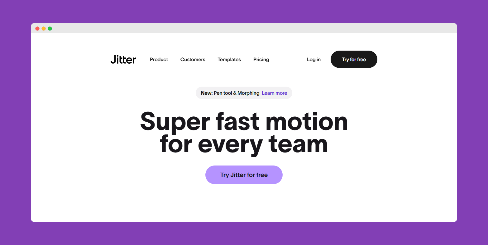
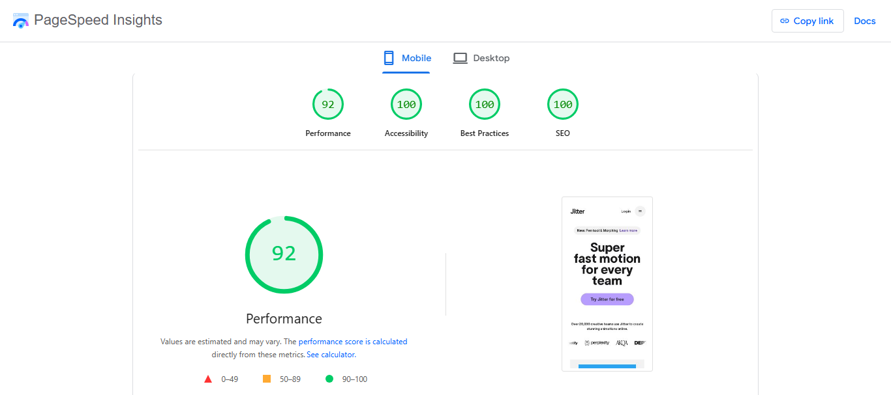
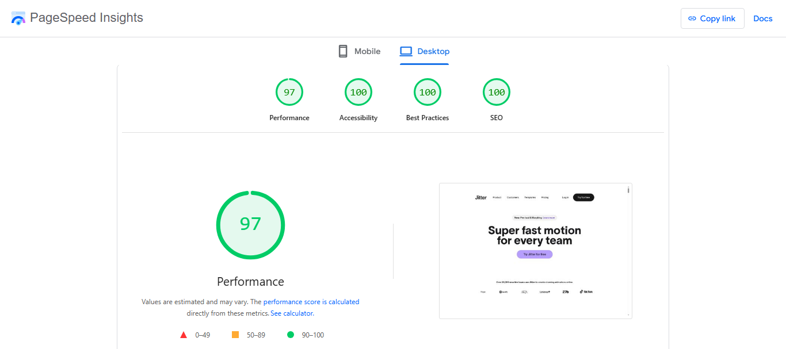

# Jitter

A landing page clone of an award winning site [Jitter](https://jitter.video), built with Next.js, TypeScript, and GSAP. This project showcases modern web development techniques including smooth animations, responsive design, and interactive elements.

🔗 **Live Demo**: [https://jitter-clone-sigma.vercel.app/](https://jitter-clone-sigma.vercel.app/)



## Performance

The website has been optimized for performance on both mobile and desktop devices.

### Mobile Performance



### Desktop Performance



## Features

- 📱 Fully responsive design that works on all device sizes
- ✨ Smooth animations and transitions using GSAP
- 🖱️ Custom scrolling experience with Lenis
- 🎨 Modern UI with Tailwind CSS
- 📦 Component-based architecture with React

## Technologies Used

- **Next.js 15** - React framework
- **React 19** - UI library
- **TypeScript** - Type safety
- **GSAP** - Animation library
- **Tailwind CSS** - Styling
- **Lenis** - Smooth scrolling

## Getting Started

### Prerequisites

- Node.js (v20 or higher)
- npm or yarn

### Installation

1. Clone the repository
   ```bash
   git clone https://github.com/Adufe-Obanijesu/jitter_clone.git
   cd jitter_clone
   ```

2. Install dependencies
   ```bash
   npm install
   # or
   yarn
   ```

3. Start the development server
   ```bash
   npm run dev
   # or
   yarn dev
   ```

4. Open [http://localhost:3000](http://localhost:3000) in your browser

## Building for Production

```bash
npm run build
# or
yarn build
```

The built files will be in the `.next` directory.

## Project Structure

- `src/` - Source code
    - `app/` - Next.js app directory
    - `components/` - Reusable UI components
    - `sections/` - Main page sections
    - `hooks/` - Custom React hooks
    - `data/` - Static data
    - `effects/` - Animation effects
    - `utils/` - Utility functions
- `public/` - Static assets

## License

This project is for educational purposes only. The original design belongs to [Jitter](https://jitter.video/).
